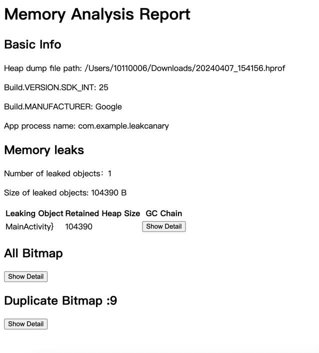

## ManageHprofPage

You can see all hprof file which recently opened.

Quickly and automatically export hprof files from mobile phone

Wait Dumping Done

Analyze memory leaks and show gc chain

Bitmap Preview and Export Bitmap

Analyze Duplicate Bitmap

Generate a analyze report,and you can open it in browser

Pull the hprof files generated by LeakCanary on mobile phone

 