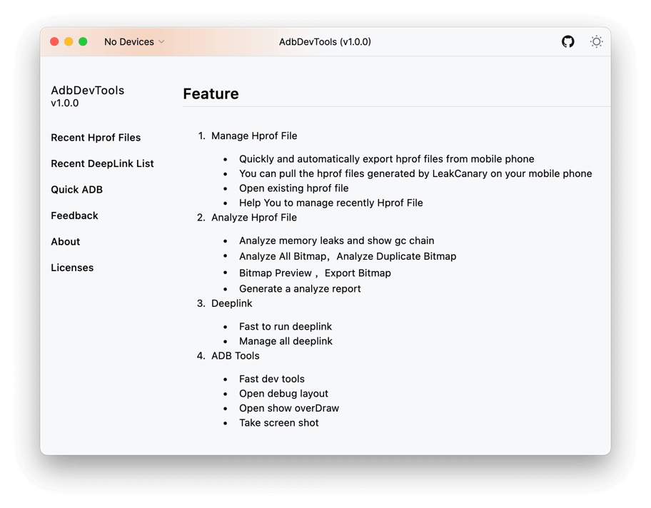

# This is an Android Dev tools

## Feature
1. [Manage Hprof File](/ManageHprofPage.md) 
   * Quickly and automatically export hprof files from mobile phone
   * You can pull the hprof files generated by LeakCanary on your mobile phone
   * Open existing hprof file
   * Help You to manage recently Hprof File 
2. [Analyze Hprof File](/ManageHprofPage.md) 
   * Analyze memory leaks and show gc chain
   * Analyze All Bitmap，Analyze Duplicate Bitmap
   * Bitmap Preview ，Export Bitmap
   * Generate a analyze report
3. [Deeplink](/DeepLinkPage.md)
   * Fast to run deeplink
   * Manage all deeplink
4. [ADB Tools](/ADBToolsPage.md)
   * Fast dev tools
   * Open debug layout
   * Open show overDraw
   * Take screen shot